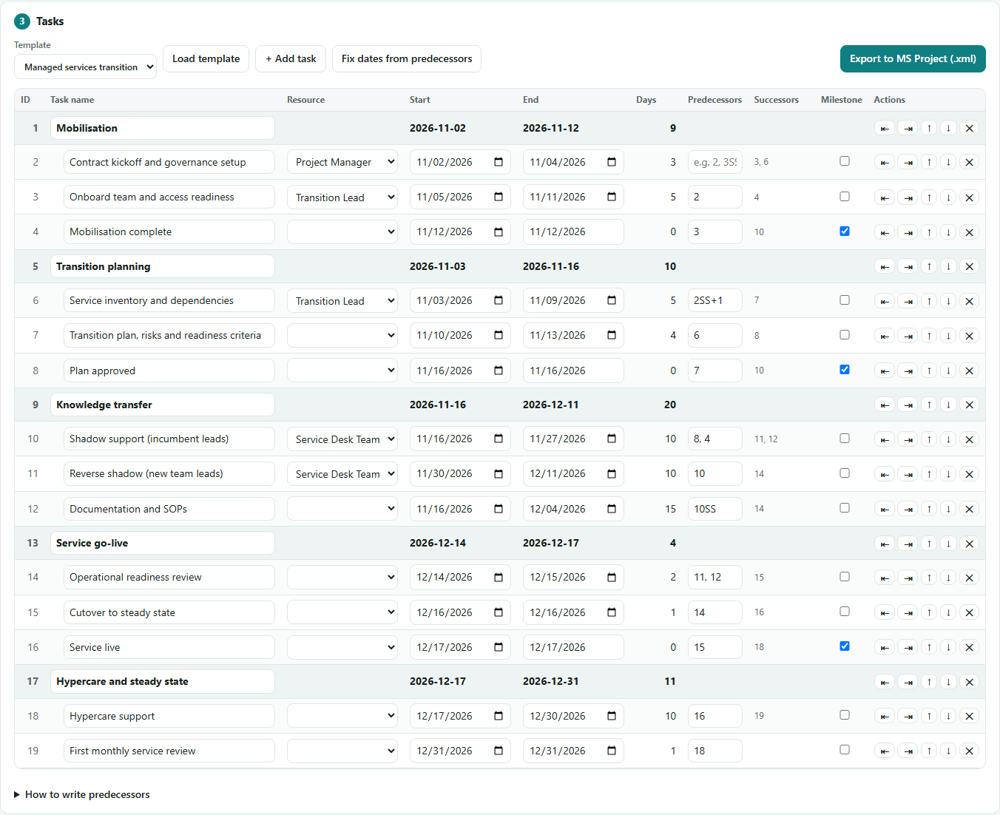
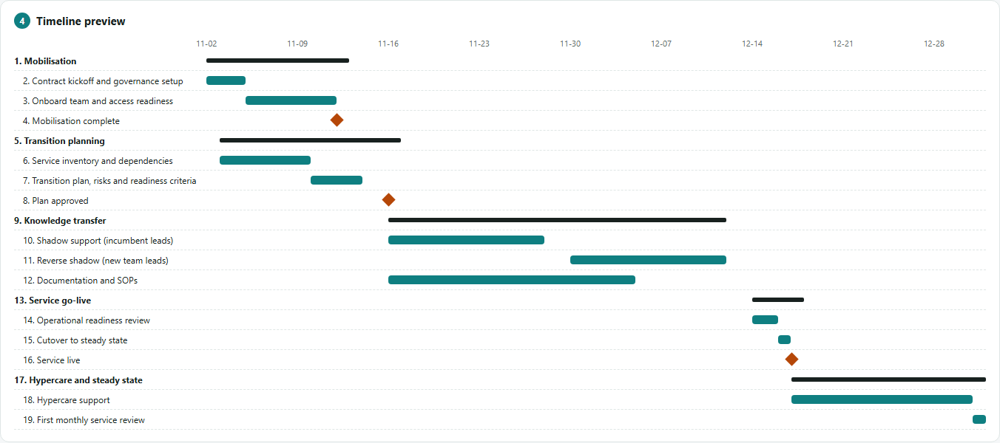

# Project Plan Builder

Build a project plan in your browser and open it in **Microsoft Project** with tasks, dependencies, milestones, phases and resources already in place.

**Live app:** https://qureshirauf.com/tools/project-plan-builder/

## Why

Setting up a new plan in MS Project usually means typing every task, then linking predecessors one dialog at a time. This tool keeps the input to what a project manager actually decides:

1. **Project name**
2. **Resources**
3. **Start and end date** for each task

Predecessors are typed straight into a field (`2`, `3SS`, `4FS+2`), successors are worked out automatically, and one click exports a file MS Project opens as a fully linked schedule.

## Features

- **Templates:** standard project lifecycle (Initiation → Closure) and managed services transition (Mobilisation → Knowledge transfer → Go-live → Hypercare), or a blank plan.
- **Predecessors in one field:** Finish-to-Start, Start-to-Start, Finish-to-Finish and Start-to-Finish links with lag or lead in days or weeks.
- **Automatic successors:** filled in as you type predecessors, and links stay correct when rows are moved.
- **Sub-tasks and phases:** click **+ Sub-task** on any row to add a task under it (the row becomes a phase and hands its resource, links and leave to the first sub-task), or indent and outdent rows.
- **Milestones:** tick a box for zero-day checkpoints.
- **Project start date:** pick a date and the whole plan moves to it, keeping durations and links.
- **Target end date:** warns if the plan runs late and shows a deadline line on the timeline.
- **Fix dates from predecessors:** pushes tasks forward so none starts before its dependencies allow.
- **Checks:** flags unreadable predecessors, dependency loops and tasks that end before they start.
- **Resource rates:** standard rate, overtime rate (per hour or per day), cost per use and a currency symbol for each resource, with a planned cost per resource and in total. They export to MS Project's Std. Rate, Ovt. Rate and Cost/Use fields so MS Project calculates task costs.
- **Resource leave:** pick a first day on the calendar and a number of working days, either per resource or directly in a task's **Leave** column (for that task's resource). Overlapping tasks get a warning and the timeline shades the leave days. In MS Project the leave becomes non-working time on that resource's calendar, so their tasks stretch around it, and a **Leave** custom field (Text1) is filled on tasks and resources.
- **Timeline preview:** a live Gantt view of the plan.
- **Download PDF:** a landscape A4 report with a project summary, the task list, resources with rates and leave, and a Gantt timeline, ready to share with people who don't use MS Project.
- **Export to MS Project:** produces an MS Project XML file (MSPDI) with tasks, outline levels, links, lags, milestones, a Mon–Fri calendar, resources and assignments.
- **Import:** load a plan downloaded earlier, or one saved from MS Project as XML, and keep editing it.
- **Autosave:** work is saved in the browser, with no account or server.

## Predecessor syntax

| You type | Meaning |
|---|---|
| `3` | Task 3 must finish before this one starts (Finish-to-Start) |
| `3SS` | Starts together with task 3 |
| `3FF` | Finishes together with task 3 |
| `3SF` | Start-to-Finish |
| `3FS+2` | Starts 2 working days after task 3 finishes |
| `4SS+1w` | Starts 1 week after task 4 starts |
| `5FS-1` | Overlaps task 5 by 1 day |
| `2, 3SS+1` | Several links, separated by commas |

## Opening the plan in MS Project

1. Click **Download for MS Project (.xml)**.
2. In MS Project: **File → Open**, set the file type to **XML**, and pick the file.
3. Save it as `.mpp`.

On Windows you can skip the dialogs: double-click **`Open-In-Project.bat`**. It opens the newest exported plan from your Downloads folder in MS Project and saves it as `.mpp` next to it.

## Editing a plan later

Click **Import plan (.xml)**, or drag the file onto the page, to load a plan back into the builder and keep editing it. This works for:

- a file you downloaded from the builder, and
- a plan edited in MS Project: **File → Save As**, choose **XML Format (\*.xml)**, then import that file. Browsers can't read `.mpp` files directly.

Tasks, phases, dates, links and lags, milestones, resources, rates, currency and resource leave are brought back. The builder has one resource per task, so if MS Project has several on a task, the one with the most work is kept. Lags are rounded to whole days and material or cost resources are skipped; the import message lists anything that was changed.

## Run it locally

No build step and no dependencies: download the repository and open `index.html` in any modern browser. The only exception is **Download PDF**, which loads [jsPDF](https://github.com/parallax/jsPDF) from cdnjs the first time it is used, so it needs an internet connection.

## Notes

- **Working calendar:** Monday to Friday, 8 hours a day (08:00–12:00, 13:00–17:00).
- **Start dates:** each task's start goes into MS Project as *Start No Earlier Than*, so linked tasks can move later but never earlier than the date you set.
- **Tested with:** Microsoft Project 2016. Every task's start, finish, duration and milestone flag was compared after import.

## Contributing

Issues and pull requests are welcome. Ideas: several resources per task, public holiday calendars, Excel/CSV import, printable Gantt charts, translations.

## Support

The tool is free and open source. If it saved you time, you can send a **$2** thank-you by scanning this QR code with your banking or wallet app (also available from **♥ Support** in the app):

## License

MIT. See [LICENSE](LICENSE).

Built by [Abdul Rauf Qureshi](https://qureshirauf.com).
